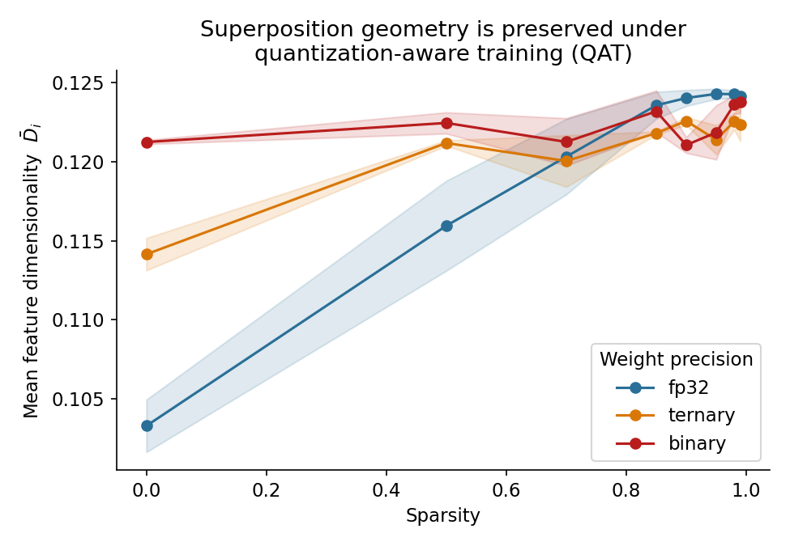
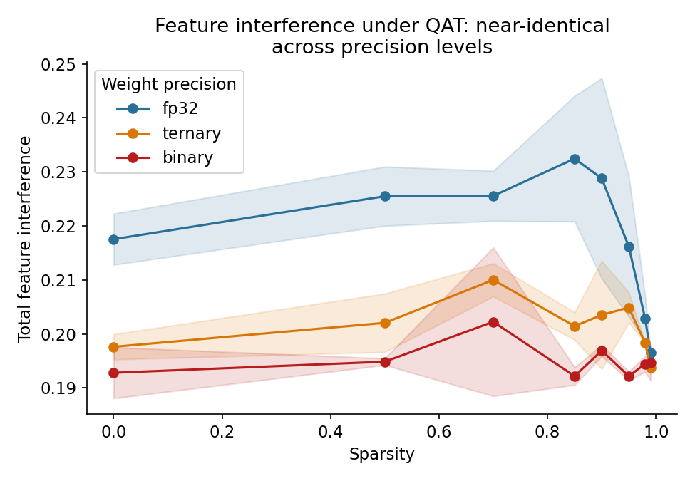
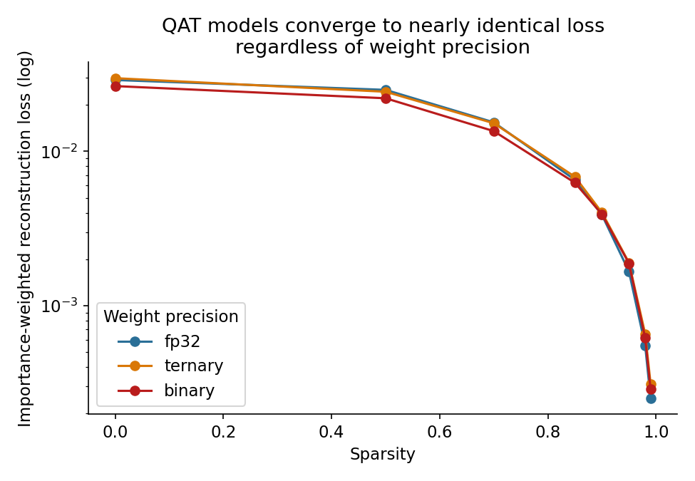
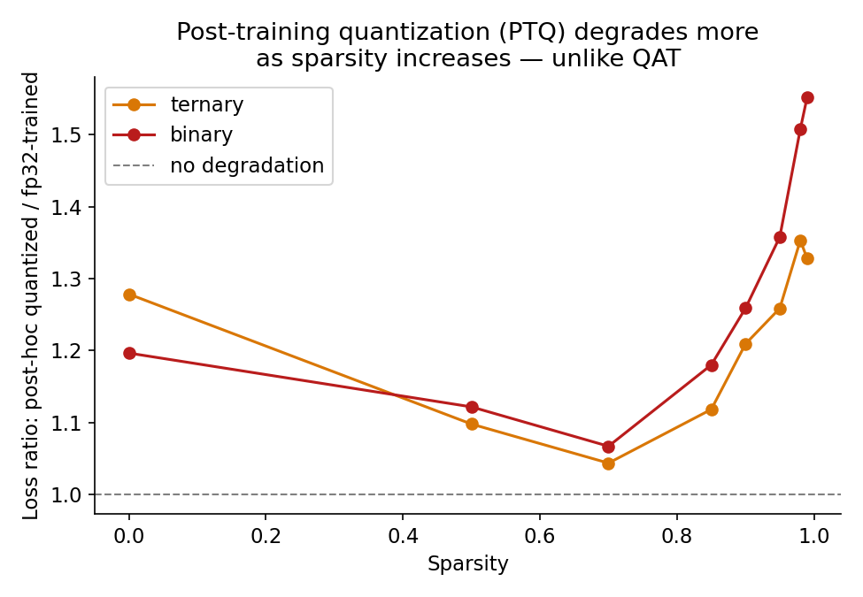

# Superposition with Weight Quantization: A Toy Model Study

## Overview

This project investigates how weight quantization affects superposition geometry in neural networks using a toy model framework. I reproduce and extend the work of [Elhage et al. (2022)](https://transformer-circuits.pub/2022/toy_model/) "Toy Models of Superposition" by introducing quantization-aware training (QAT) and post-training quantization (PTQ) as additional experimental dimensions.

The key research question: **Does quantization preserve the geometric structure of superposition?**

## Motivation

Superposition, representing more features than hidden dimensions through geometric packing, is fundamental to how neural networks achieve expressiveness. Understanding superposition geometry is critical for interpretability: tools like dictionary learning and causal analysis assume specific geometric properties of learned representations.

However, real-world deployments of neural networks frequently use **quantization** to reduce model size and latency. The question is: **does quantization preserve the geometric structure that interpretability tools depend on?**

This work addresses this gap by investigating two quantization regimes:
- **Quantization-Aware Training (QAT)**: Does allowing the optimizer to adapt to quantization preserve geometry?
- **Post-Training Quantization (PTQ)**: Is the learned superposition structure robust when quantization is imposed post-hoc?

The distinction matters: QAT requires training infrastructure few downstream deployers have, while PTQ is standard practice but may silently break interpretability assumptions, especially for sparse (rare) features.

## Model Architecture

**Configuration:**
- **Features**: 40 synthetic features with exponentially decaying importance (decay=0.9)
- **Hidden dimensions**: 5 (8x compression ratio)
- **Model**: $\hat{x} = \text{ReLU}(W^T W x + b)$ where $W \in \mathbb{R}^{40 \times 5}$

**Sparsity Levels:** 0.0, 0.5, 0.7, 0.85, 0.9, 0.95, 0.98, 0.99

Each feature independently appears with probability $(1 - \text{sparsity})$ with magnitude uniform in [0,1].

## Quantization Methods

### Quantization-Aware Training (QAT)
Models trained from scratch with quantization applied via straight-through estimator (STE):
- **fp32**: Baseline, no quantization
- **Ternary**: $W_q \in \{-\alpha, 0, \alpha\}$ with threshold-based ternarization (TWN-style)
- **Binary**: $W_q \in \{-\alpha, \alpha\}$ with per-row scaling

### Post-Training Quantization (PTQ)
1. Train fp32 model to convergence
2. Apply quantization without retraining
3. Compare to QAT performance as a baseline degradation metric

## Metrics

### Per-Feature Dimensionality
$$D_i = \frac{\|W_i\|^4}{\sum_j (W_i \cdot W_j)^2}$$

**Interpretation:**
- $D_i = 1$: Feature has dedicated orthogonal dimension
- $D_i \to 0$: Feature packed in heavy superposition with others

### Total Interference
Normalized sum of squared off-diagonal entries of the Gram matrix $G = WW^T$:
$$\text{Interference} = \frac{1}{n(n-1)} \sum_{i \neq j} (G_{\text{norm},ij})^2$$

Measures how much features interfere with each other in the learned representation.

### Active Feature Fraction
Fraction of features with representation norm exceeding 5% of maximum norm. Captures sparse structure in the learned model.

## Results Summary

### Key Finding 1: QAT Preserves Superposition Geometry Across Precision

Across the full sparsity sweep, mean per-feature dimensionality, total interference, and final reconstruction loss are **nearly identical** between fp32, ternary, and binary QAT models (differences are within seed-to-seed noise; see `results/results.json`). The qualitative shape reported in the original toy-models paper — dimensionality rising with sparsity as more features get dedicated directions — reproduces cleanly in all three precision regimes.

**Figures 1–3: QAT Results**





This is a genuine (if perhaps unsurprising in hindsight) finding: **when the optimizer is allowed to adapt to the quantization constraint, it finds a superposition solution that is essentially precision-invariant.** The constraint changes how a feature's weight vector is represented, not the higher-level geometric solution to the packing problem.

### Key Finding 2: PTQ Degrades in a Sparsity-Dependent Way

Applying quantization after training, with no retraining, tells a different story. The ratio of post-hoc-quantized loss to the original fp32 loss rises from **~1.1× at low sparsity to 1.3–1.55× at high sparsity (>0.95)**, and is consistently worse for binary than ternary.

**Figure 4: PTQ Degradation Ratio**



This is the opposite of the QAT result: **the fp32-trained weight geometry is not robust to having quantization imposed on it externally, and the gap widens exactly in the highly-sparse regime** — which is the regime most relevant to real feature dictionaries, where the vast majority of features are rare.

### Key Finding 3: Implications for Interpretability and Deployment

Put together, these results suggest a **specific, testable claim** rather than a blanket "quantization is fine" or "quantization breaks interpretability":

> **Robustness of superposition structure to quantization depends on whether the quantization was present during training.**

- **QAT models**: Interpretability results derived from a comparable fp32 model may transfer reasonably well, since geometric structure is preserved.
- **PTQ models**: The geometric assumptions an interpretability tool relies on are measurably violated, and the violation gets worse for sparse, rare features — which are usually the most safety-relevant ones to track.

This distinction matters in practice: QAT requires access to training infrastructure that most downstream deployers don't have. PTQ is far more common, but our results show it incurs a geometric cost, especially for interpretability applications.

## Project Structure

```
QAT Superposition/
├── helper/                    # Reusable modules
│   ├── model.py              # ToyModel class & training loop
│   └── metrics.py            # Dimensionality & interference calculations
├── experiments/              # Executable scripts
│   ├── run_sweep.py          # Main QAT experiments (generates results.json)
│   ├── run_ptq_comparison.py # PTQ vs QAT comparison (generates ptq_results.json)
│   └── make_figures.py       # Plotting & visualization
├── results/                  # Generated outputs
│   ├── results.json          # QAT experiment data
│   ├── ptq_results.json      # PTQ comparison data
│   ├── fig1_dimensionality_qat.png
│   ├── fig2_interference_qat.png
│   ├── fig3_loss_qat.png
│   └── fig4_ptq_degradation.png
├── README.md                 # This file
└── .gitignore
```

## Running the Experiments

### Requirements
```bash
pip install torch numpy matplotlib
```

### Execution Order

**Step 1: QAT Training Sweep**
```powershell
cd experiments
python run_sweep.py
```
- Trains models across 3 precision levels × 8 sparsity levels × 2 seeds = 48 configurations
- Typical runtime: 5-10 minutes (CPU) or <1 minute (GPU)
- Output: `results/results.json`

**Step 2: PTQ Comparison**
```powershell
python run_ptq_comparison.py
```
- Compares PTQ vs QAT at each sparsity level
- Requires: completed `run_sweep.py`
- Output: `results/ptq_results.json`

**Step 3: Generate Figures**
```powershell
python make_figures.py
```
- Creates all 4 PNG figures from JSON results
- Requires: both JSON files from Steps 1 & 2
- Output: `fig1_*.png` through `fig4_*.png` in `results/`

## Key Implementation Details

### Straight-Through Estimator (STE)
Quantization is implemented with STE for gradient flow during QAT:
```python
class STEQuantize(torch.autograd.Function):
    @staticmethod
    def forward(ctx, w, mode):
        # Apply quantization in forward pass
        return quantized_w
    
    @staticmethod
    def backward(ctx, grad_output):
        # Gradient passes through unchanged (straight-through)
        return grad_output, None
```

### Path Handling
All file I/O uses relative paths based on script location:
```python
BASE_PATH = os.path.dirname(os.path.abspath(__file__))
```
This ensures reproducibility across different machines.

## Extensions & Future Work

1. **Real Network Validation**: Apply QAT vs PTQ comparison to actual vision/NLP models to validate whether the geometric findings transfer beyond toy models
2. **Interpretability Tool Robustness**: Empirically test how interpretability tools (SAEs, attention pattern analysis) degrade under PTQ vs maintain fidelity under QAT
3. **Higher-Precision Quantization**: Investigate 4-bit, 8-bit quantization as intermediates between fp32 and binary/ternary
4. **Dynamic Importance Weighting**: Train with different importance decay factors to model realistic feature frequency distributions
5. **Mixed-Precision QAT**: Explore layer-wise or feature-wise quantization choices to optimize for both compression and geometry preservation
6. **Theoretical Characterization**: Prove sufficient conditions under which superposition geometry is preserved during quantization
7. **Sparse QAT**: Combine structured pruning with QAT to understand interaction effects
8. **Interpretability-Aware Quantization**: Design quantization schemes that explicitly optimize for preserving interpretability-relevant features

## References

- Elhage, N., Nanda, N., Olsson, C., Schiefer, N., Henighan, T., Joseph, S., Mann, B., Askell, A., Bai, Y., Chen, A., Conerly, T., DasSarma, N., Drain, D., Elsheriff, M., Farhi, N., Ganguli, D., Gilson, A., Hernandez, D., Jones, A., Kaplan, J., Kernion, J., Lukošiūtė, K., Ndousse, K., Rauh, L., Rausch, S., Sal Voss, C., Schiefer, J., Schuhmann, D., Shanahan, M., Shen, X., Shoker, S., Sutawika, L., Talts, J., Taylor, J., Teufel, A., Tyson, Z., Viégas, F., Wang, J., Wang, J., Wark, C. & Zhang, Y. (2022). [Toy Models of Superposition](https://transformer-circuits.pub/2022/toy_model/). Transformer Circuits Thread.
- Zhou, M., Wu, Y., Shi, Z., & Huang, Y. (2021). Towards efficient quantization-aware training. arXiv preprint arXiv:2104.14294.

## License

MIT License - See LICENSE file for details.

## Questions?

For questions about the experiments, refer to the inline documentation in:
- `helper/model.py` - Model and training implementation
- `helper/metrics.py` - Metric calculations
- `experiments/run_sweep.py` - Main experiment loop
